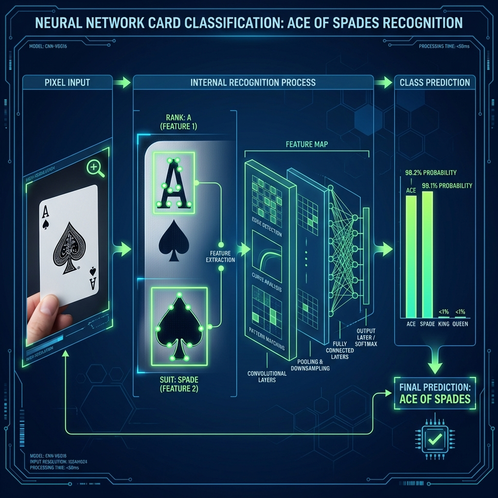
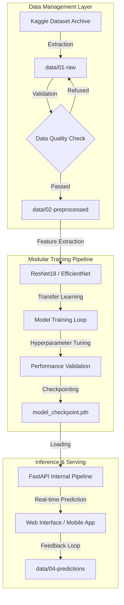

# Card Classifier - Playing Card Classification with PyTorch

[English] | [Português]

This project implements a Deep Learning model to classify playing cards into their respective categories, following ML Engineering standards.
Este projeto implementa um modelo de Deep Learning para classificar cartas de baralho em suas respectivas categorias, seguindo os padrões de Engenharia de ML Sênior.

## Model Journey / Jornada do Modelo


## Internal Recognition Logic / Lógica Interna de Reconhecimento


### Elaborate Technical Pipeline / Pipeline Técnico Detalhado


## Technologies Used / Tecnologias Utilizadas
- **Language**: Python 3.10+
- **Deep Learning**: PyTorch, Torchvision
- **API Framework**: FastAPI, Uvicorn
- **Containerization**: Docker, Docker Compose
- **Orchestration**: Kubernetes (K8s)
- **Data Engineering**: PIL, NumPy, Pandas
- **Visualization**: Matplotlib, Seaborn
- **Automation**: Makefile

## Project Structure / Estrutura do Projeto (Senior ML Template)
Extending the repository into a production-ready, modular architecture:
Expandindo o repositório em uma arquitetura modular pronta para produção:

- `config/`: Environment-specific configurations / Configurações por ambiente (`local.yaml`, `prod.yaml`).
- `data/`: Structured data flow / Fluxo de dados estruturado (`01-raw` to `04-predictions`).
- `entrypoint/`: Application entrypoints / Pontos de entrada (`train.py`, `inference.py`).
- `notebooks/`: Jupyter notebooks for EDA and baselines / Notebooks para análise exploratória.
- `src/`: Core source code and modular ML pipelines / Código fonte e pipelines modulares.
- `tests/`: Automated unit and integration tests / Testes automatizados.
- `Dockerfile`, `docker-compose.yml`, `Makefile`: Orchestration and DevOps / Orquestração e DevOps.

## Instructions / Instruções

### 1. Setup Data / Configuração de Dados
The model expects data in `data/train` and `data/val`. Download it from [Kaggle](https://www.kaggle.com/datasets/gpiosenka/cards-image-datasetclassification).
O modelo espera dados em `data/train` e `data/val`. Baixe do [Kaggle](https://www.kaggle.com/datasets/gpiosenka/cards-image-datasetclassification).

### 2. Setup Environment / Ambiente Virtual
**Windows (PowerShell):**
```powershell
python -m venv venv
.\venv\Scripts\Activate.ps1
pip install -r requirements-prod.txt
```

**Linux/macOS:**
```bash
python3 -m venv venv
source venv/bin/activate
pip install -r requirements-prod.txt
```

### 3. Training / Treinamento
```bash
python -m entrypoint.train
```

### 4. Running the Web Service / Executando o Serviço Web
```bash
python -m entrypoint.inference
```

### 5. Docker Deployment / Deploy com Docker
```bash
docker-compose up --build
```

### 6. Kubernetes / Deploy em Cluster
```bash
kubectl apply -f k8s/deployment.yaml
```
